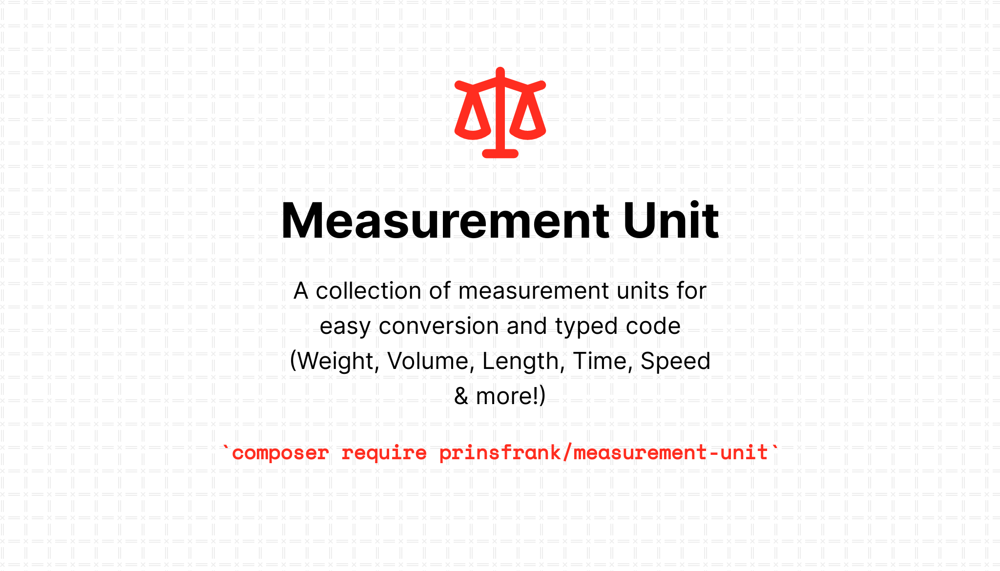

## Fork Notice                                                                                                                                                                        
                                                                                                                                                                                    
This is a fork of [prinsfrank/measurement-unit](https://github.com/prinsfrank/measurement-unit).
                                                                                                                                                                                    
**Changes:**                                                                                                                                                                          
- Non-breaking Re-architecure #f794b0a
  - Abstract MeasurementUnit::class and MeasurementUnitInterface::interface 
  - MeasurementUnit extends Stringable
- Added Angle units Degrees & Radians #d3f30fc
- Added Percentage unit "Percent" #d3f30fc
- Output formatting utility methods (`toHTML()`, `toFormat()` & `__toString()`) #e07f1bc
- Utility class to set custom unit symbols. #78c9ce2


## Migration Path

If prinsfrank/measurement-unit merges the pending PR:
1. We'll update dependencies to use upstream
2. This package will enter maintenance mode
3. Deprecation notices will guide migration

---

<picture>
    <source srcset="docs/images/banner_dark.png" media="(prefers-color-scheme: dark)">
    
</picture>

# Measurement-unit


[](https://codecov.io/gh/PrinsFrank/measurement-unit)

## Setup

> **Note**
> Make sure you are running PHP 8.1 or higher to use this package

To use this package in your project, run the following command:

```shell
composer require prinsfrank/measurement-unit
```

## Provided units

| Type        | Available unit                                                                                                    |
|-------------|-------------------------------------------------------------------------------------------------------------------|
| Agnle       | Degree, Radian                                                                                                    |
| Length      | Centimeter, Fathom, Foot, Furlong, HorseLength, Inch, Kilometer, Meter, Millimeter, NauticalMile, StatuteMile, SurveyMile, Thou, Yard     |
| Percentage  | Percent                                                                                                           |
| Pressure    | Bar, Hectopascal, Kilopascal, Millibar, MillimetreOfMercury, Pascal, PoundPerSquareInch, StandardAtmosphere, Torr | 
| Speed       | KilometerPerHour, Knot, MeterPerSecond, MilesPerHour                                                              |
| Temperature | Celsius, Fahrenheit, Kelvin, Rankine                                                                              |
| Time        | Day, Hour, Minute, Second                                                                                         |
| Torque      | NewtonMeter                                                                                                       |
| Volume      | CubicInch, CubicMeter, CubicYard, FluidDram, FluidOunce, Liter, Pint, Quart, TableSpoon                           |
| Weight      | Kilogram, MetricTon, Pound                                                                                        |

All the units of a type can be converted to each other with corresponding methods.
